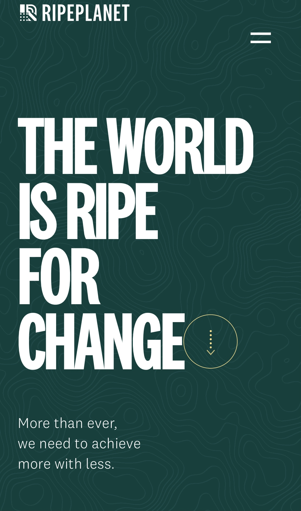
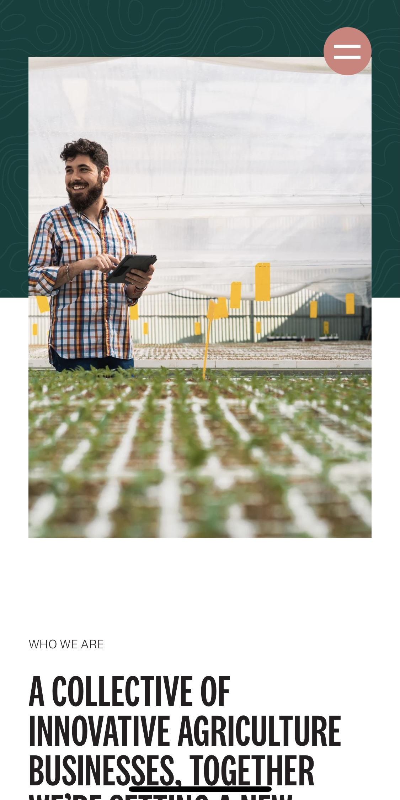
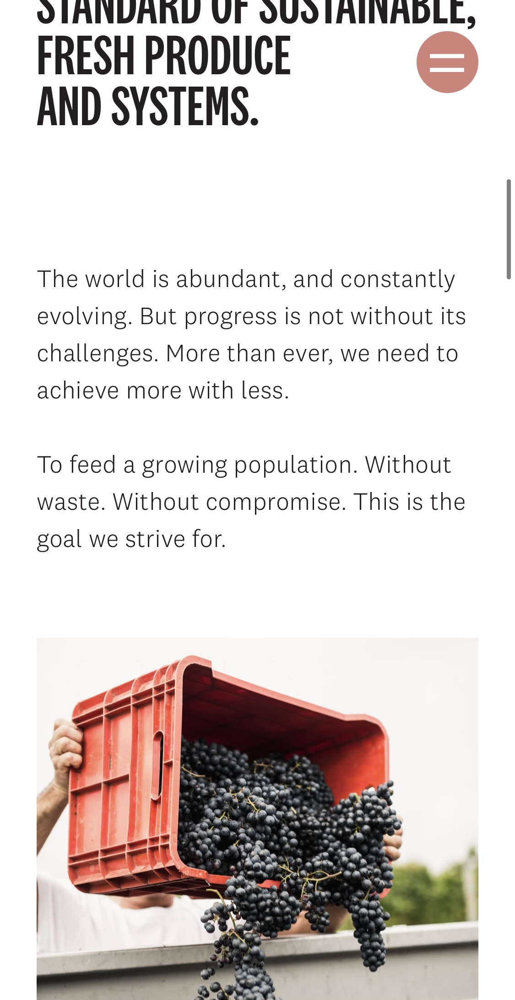
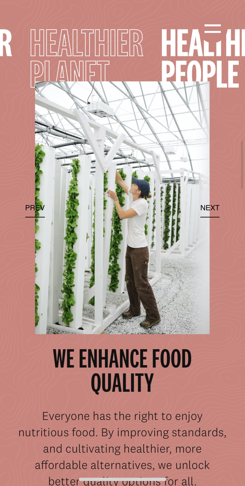
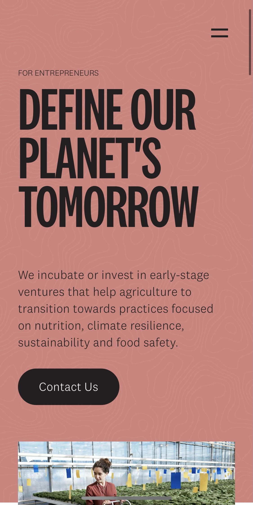
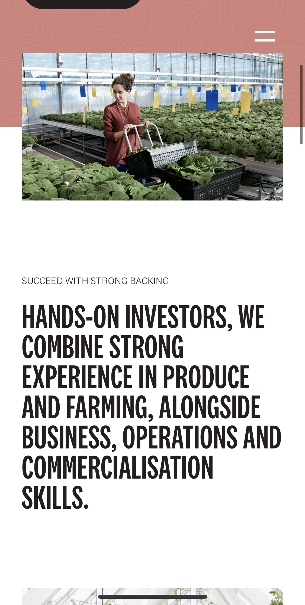
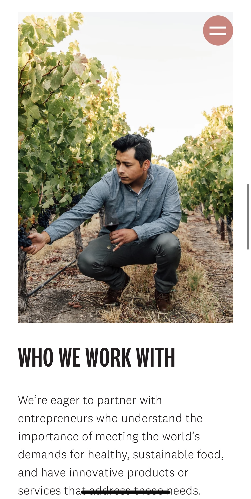
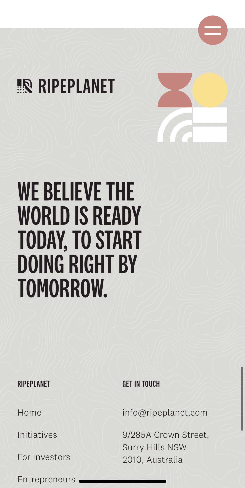

# Procesverslag
**Auteur:** -Sem Spiekman-

Markdown cheat cheet: [Hulp bij het schrijven van Markdown](https://github.com/adam-p/markdown-here/wiki/Markdown-Cheatsheet). Nb. de standaardstructuur en de spartaanse opmaak zijn helemaal prima. Het gaat om de inhoud van je procesverslag. Besteedt de tijd voor pracht en praal aan je website.

## Bronnenlijst
1. https://www.w3schools.com/howto/howto_js_slideshow.asp
2. https://css-tricks.com/snippets/css/a-guide-to-flexbox/
3. https://dlo.mijnhva.nl/d2l/le/content/192710/Home
4  https://www.w3schools.com/css/css3_flexbox_responsive.asp
5  https://ripeplanet.com/investors
6  https://www.youtube.com/watch?v=MR2xuIy6V7g&ab_channel=DeltatyCode*/
7  https://stackoverflow.com/questions/19609387/change-image-when-clicking-button/19609457

## Eindgesprek (week 7/8)

-dit ging goed & dit was lastig-

**Screenshot(s):**

-screenshot(s) van je eindresultaat-

## Voortgang 3 (week 6)

Deze week de voorlopige versie laten zien, de eerste pagina is voor mobiel af, voor desktop nog niet geoptimaliseerd.
Deze week liep ik tegen het onderelkaar zetten van content in een  flexbox row, uiteindelijk in de voorgang opgelost.

## Voortgang 2 (week 5)

| Student 1 - Zoe | Student 2 - Maryem | Student 3 - Anne | Student 4 - Sem |
| ---            | ---                | ---          | ---              |
| -  | Menu/nav  | Tekst in afbeelding  | Paralex scrol in afbeelding  |
| - | Content na nav | Div in goed container | Slider animatie |
| - | Hoeveelheid h1 | Breakdownschets controleren  | Flexbox layout |
| - | Hoeveelheid css | -  | - |
| - | Bronnen | -  | -

## Voortgang 1 (week 3)

### Stand van zaken

Menu nog wat problemen animatie vragen, deze week ben ik bezig geweest met de eerste pagina, alle html staat, en css is mee begonnen.

### Agenda voor meeting

-samen met je groepje opstellen-

<table>
<thead>
<tr>
<th>Student 1 - Zoe</th>
<th>Student 2 - Maryem</th>
<th>Student 3 - Anne</th>
<th>Student 4 - Sem</th>
</tr>
</thead>
<tbody>
<tr>
<td>Mijn website</td>
<td>Mijn website</td>
<td>Mijn website</td>
<td>Mijn website</td>
</tr>
<tr>
<td>Breakpoint</td>
<td>Slider</td>
<td>Waar kan ik het best mee beginnen</td>
<td>Menu en nav</td>
</tr>
<tr>
<td>Product slider</td>
<td>Uitklappen van menu</td>
<td>Zoekbalk en animatie menu</td>
<td>Automatische letter slider</td>
</tr>
</tbody>
</table>
### Verslag van meeting

-na afloop snel uitkomsten vastleggen-

## Breakdownschets (week 1)

## Intake (week 1)
-uitwerken voor de kick-off werkgroep - begin van de eerste week-

**Je startniveau:** -rood-

**Je focus:** -surface plane-

**Je opdracht:** -https://ripeplanet.com/-

**Screenshot(s) van de eerste pagina (small screen):**

**Screenshot(s) van de tweede pagina (small screen):**

