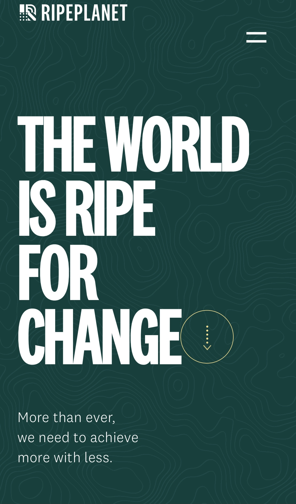
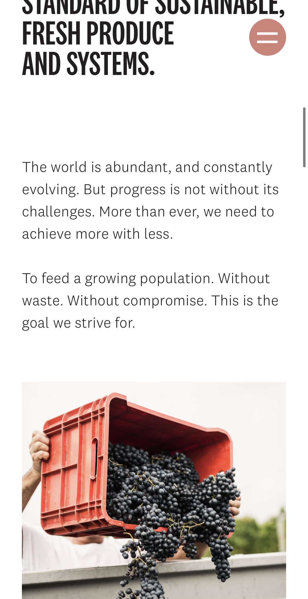
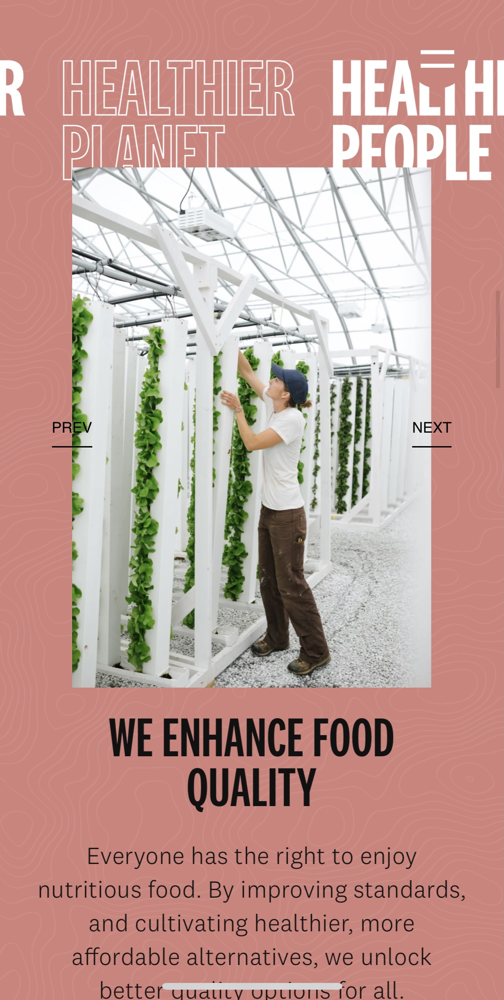
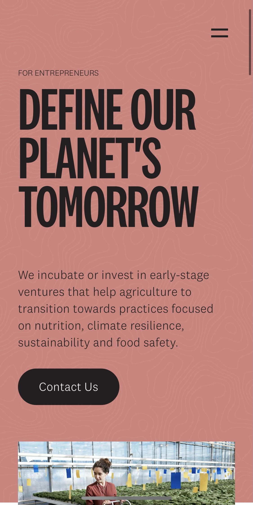
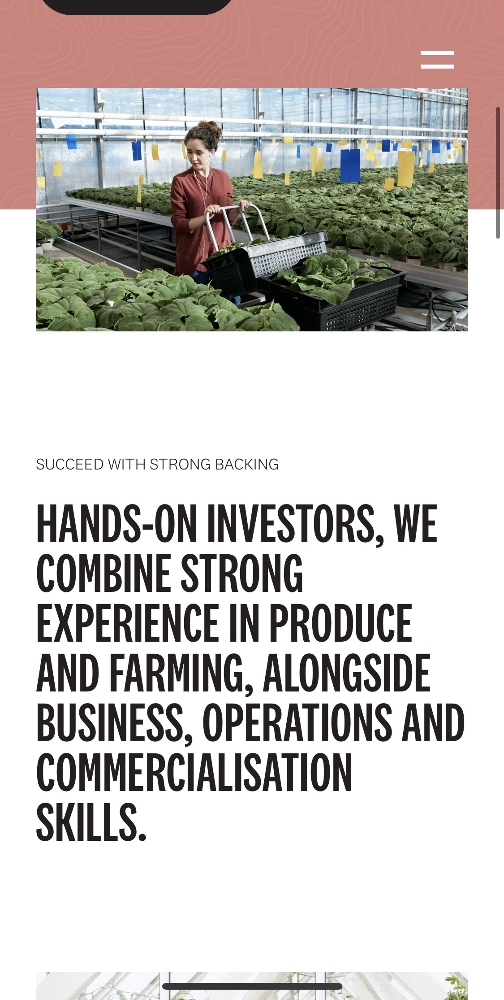
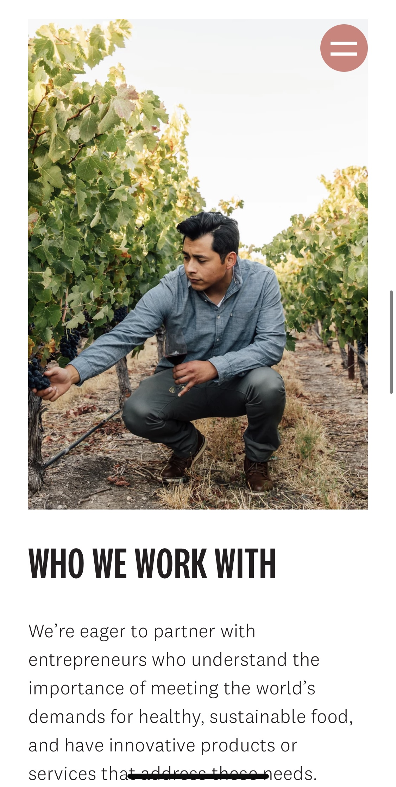
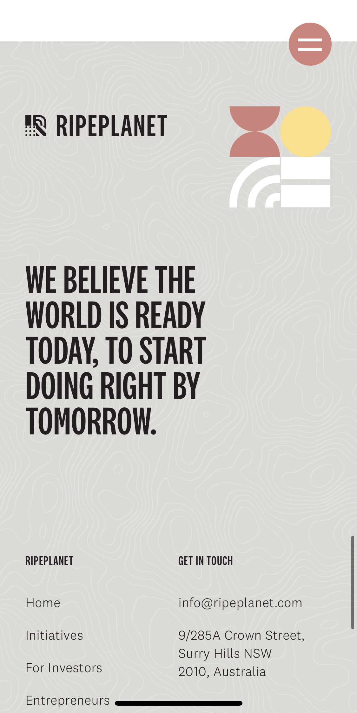

# Procesverslag
**Auteur:** -jouw naam-

Markdown cheat cheet: [Hulp bij het schrijven van Markdown](https://github.com/adam-p/markdown-here/wiki/Markdown-Cheatsheet). Nb. de standaardstructuur en de spartaanse opmaak zijn helemaal prima. Het gaat om de inhoud van je procesverslag. Besteedt de tijd voor pracht en praal aan je website.

## Bronnenlijst
1. -bron 1-
2. -bron 2-
3. -...-

## Eindgesprek (week 7/8)

-dit ging goed & dit was lastig-

**Screenshot(s):**

-screenshot(s) van je eindresultaat-

## Voortgang 3 (week 6)

-same as voortgang 1-

## Voortgang 2 (week 5)

-same as voortgang 1-

## Voortgang 1 (week 3)

### Stand van zaken

-dit ging goed & dit was lastig-

**Screenshot(s):**

-screenshot(s) van hoe ver je bent met korte uitleg-

### Agenda voor meeting

-samen met je groepje opstellen-

<table>
<thead>
<tr>
<th>Student 1 - Zoe</th>
<th>Student 2 - Maryem</th>
<th>Student 3 - Anne</th>
<th>Student 4 - Sem</th>
</tr>
</thead>
<tbody>
<tr>
<td>Mijn website</td>
<td>Mijn website</td>
<td>Mijn website</td>
<td>Mijn website</td>
</tr>
<tr>
<td>Breakpoint</td>
<td>Slider</td>
<td>Waar kan ik het best mee beginnen</td>
<td>Menu en nav</td>
</tr>
<tr>
<td>Product slider</td>
<td>Uitklappen van menu</td>
<td>Zoekbalk en animatie menu</td>
<td>Automatische letter slider</td>
</tr>
</tbody>
</table>
### Verslag van meeting

-na afloop snel uitkomsten vastleggen-

## Breakdownschets (week 1)

-uitwerken voor de 1e werkgroep - eind van de eerste week-

## Intake (week 1)
-uitwerken voor de kick-off werkgroep - begin van de eerste week-

**Je startniveau:** -rood-

**Je focus:** -surface plane-

**Je opdracht:** -https://ripeplanet.com/-

**Screenshot(s) van de eerste pagina (small screen):**

**Screenshot(s) van de tweede pagina (small screen):**

